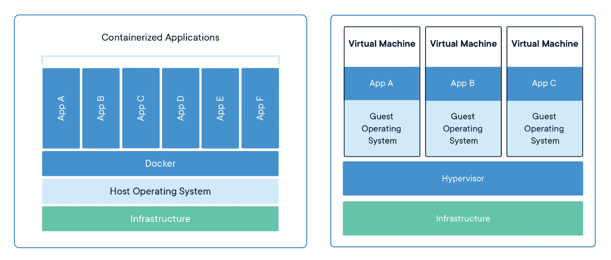
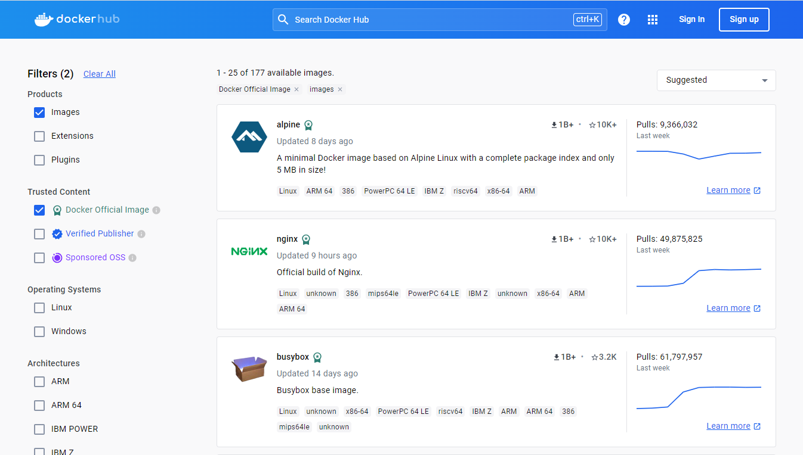
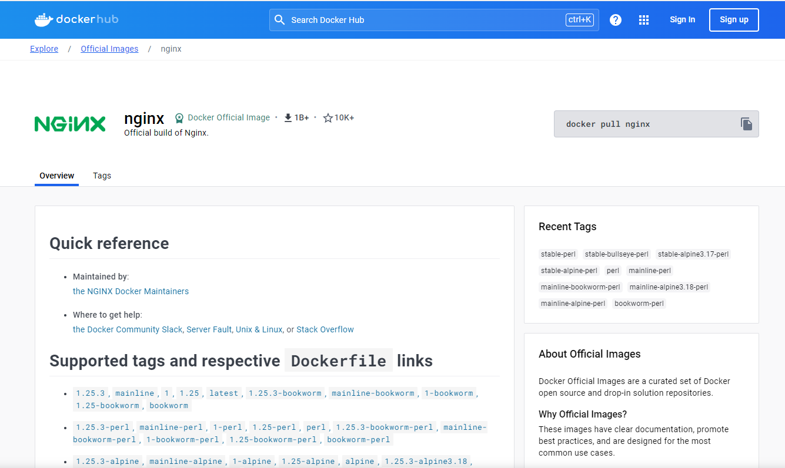

# 도커 가이드 1편: 컨테이너 소개와 기본 사용법

```text
안녕하세요   

최근에 개발 서버를 세팅하고 있습니다.   
세팅한 기록을 남겨서 운영서버 세팅시 할 때 참고해야합니다.      
아마 운영서버도 환경변수만 약간 다르고 동일하게 세팅해야될 겁니다.   

그런데 이런 과정을 반복하다보면 실수할 수도 있지 않을까요?      
세팅해야하는 운영서버가 많다면 그만큼 시간도 오래걸릴 겁니다.   
모든 세팅 과정을 프로젝트 내부에 파일 형태로 관리하면서 재활용을 할 수 있으면 좋지 않을까요?      

네, 도커를 사용한다면 개발 환경 설정을 관리하고 재사용도 아주 쉽게 할 수 있습니다.   
도커를 활용할 경우 세팅을 반복할 필요도 없고 배포도 간단해질 수 있을 것으로 기대하고 있습니다.

도커에 대해 더 학습해보고 검토 후에 프로젝트에 적용해볼 계획입니다.
```

도커는 컨테이너 기술을 효과적으로 사용하여 소프트웨어의 개발, 배포, 실행을 단순화하는 도구입니다.

이 가이드에서는 도커 컨테이너의 기본 개념과 사용법에 대해 소개합니다.


## 컨테이너란?
컨테이너는 코드를 위한 격리된 환경이라고 볼 수 있다.  
컨테이너는 독립적이고 표준화된 소프트웨어 유닛이다.    
코드와 실행하는 데 필요한 종속성을 패키지화하여 어디에서든 실행할 수 있도록 만들어져 있다.   
컨테이너를 사용시 항상 동일한 환경에서 실행하는 것을 보장할 수 있다.  
- 개발 환경과 운영 환경의 동일성을 항상 보장 가능하다
- 서로 다른 팀간의 개발 환경을 일치시킬 수 있다
- 다양한 프로젝트 운영시 버전이 서로 다를 경우 발생하는 버전 충돌 문제를 해결할 수 있다.

## 컨테이너 vs 가상 머신
- 도커 컨테이너와 가상 머신은 둘다 가상화 기술을 사용하여 환경을 격리하고 애플리케이션을 실행합니다.
- 그러나 두 기술 간에는 주요한 차이가 있습니다.



- 도커 컨테이너
  - 운영체제 가상화
    - 도커 컨테이너는 호스트 운영체제의 커널을 공유한다.
    - 각 컨테이너는 격리된 파일 시스템 및 프로세스 공간을 갖는다.
    - 호스트 운영 체제의 리소스 및 커널을 공유하기 때문에 가상 머신에 비해 가볍고 빠르다.
    - 컨테이너 단위로 캡슐화된다.
  - 이미지 용량
    - 도커 이미지는 애플리케이션과 필요한 종속성만을 포함한다.
    - 상대적으로 적은 저장 공간을 필요로 한다.
  - 구성
    - 구성 파일을 공유해서 컨테이너 이미지를 만들 수 있다.
    - 이미지를 통해 컨테이너를 쉽게 만들 수 있다.

- 가상 머신
  - 하드웨어 가상화
    - 가상 머신은 호스트 운영 체제 위에서 하드웨어를 가상화한다.
    - 가상 머신은 호스트 운영체제를 공유하지 않는다.
    - 각 가상 머신은 독립적인 운영체제를 실행하며, 전체 운영체제 커널과 필수 시스템 리소스를 포함한다.
    - 가상 머신 단위로 캡슐화된다.
  - 자체 운영 체제
    - 각 가상 머신은 자체 운영체제 이미지를 갖고 있다.
      - 운영체제가 가상 머신 별로 중복해서 설치된다.
      - 더 많은 디스크 공간과 메모리를 필요로 하기 때문에 성능이 느리다는 단점이 있다.
  - 시작 시간과 자원 소모
    - 가상 머신은 전체 운영체제를 부팅해야 하므로 시작 시간이 오래걸린다.
    - 그에 따라 더 많은 메모리와 저장 공간을 필요로 한다.
  - 이미지 용량
    - 각 가상 머신 이미지는 전체 운영체제 및 애플리케이션을 포함하므로 이미지 용량이 상대적으로 크다.
      - 가상 머신으로 분리된 환경을 생성할 수 있지만, 낭비되는 공간이 발생하고 성능이 좋지 않다.


## 도커 컨테이너의 생명주기 실습
컨테이너의 기본적인 생애주기는 생성 - 실행 - 종료 - 삭제

### 도커 설치
- 실습을 위해 윈도우 환경이라면 docker desktop 설치가 필요하다
- 윈도우 환경에서는 PowerShell 을 사용해서 진행한다.
- [설치 참고 링크](https://docs.docker.com/get-docker/)

버전 확인
```
docker version
```

도커의 모든 컨테이너 리스트 표시
- 컨테이너의 ID, 이미지 이름, 컨테이너 이름, 생성 시간, 상태 등을 표시한다.
```
docker ps -a
```

현재 다운로드한 이미지 리스트 표시
```
docker image ls
```

현재 다운로드한 이미지 리스트 표시
- 컨테이너에서 출력된 표준 출력과 표준 에러 스트림의 모든 내용을 보여준다.
- 컨테이너 로그 실시간 확인: 10줄 단위로 출력
```
docker logs [컨테이너 ID or 컨테이너명]
docker logs -n 10 -f [컨테이너 ID or 컨테이너명]
```


### 1. 컨테이너 생성
- 도커 컨테이너의 생성은 이미지를 기반으로 이루어진다.
- 이미지는 컨테이너를 생성하기 위한 파일 시스템과 실행할 어플리케이션에 대한 설정을 담고 있다.
- 이미지는 [docker hub](https://hub.docker.com/) 를 통해 검색하여 다운로드 받을 수 있다.
- Trusted Content 로 분류되는 안전한 이미지를 이용해야만 한다.
- 실습에는 nginx 이미지를 이용해보겠다.




docker hub 레지스트리로부터 이미지 다운로드
```
docker pull nginx
```

nginx 이미지를 이용해서 nginx_container 이름의 컨테이너를 생성
- 컨테이너 생성시 이미지가 필요한데 없는 경우 자동으로 최신버전의 이미지를 다운로드 받고 컨테이너가 생성된다.
```
docker create --name nginx_container nginx
```

docker ps -a 결과: Created 상태 확인
```
CONTAINER ID   IMAGE     COMMAND                   CREATED          STATUS    PORTS     NAMES
78ae9b35c32c   nginx     "/docker-entrypoint.…"   14 seconds ago   Created             nginx_container
```

### 2. 컨테이너 시작

이미 생성된 nginx_container 이름의 컨테이너를 시작
```
docker start nginx_container
```

docker ps -a 결과: Status 가 Up 으로 바뀐 것을 확인할 수 있다.
```
CONTAINER ID   IMAGE     COMMAND                   CREATED              STATUS          PORTS     NAMES
78ae9b35c32c   nginx     "/docker-entrypoint.…"   About a minute ago   Up 16 seconds   80/tcp    nginx_container
```

테스트를 위해 nginx 컨테이너를 백그라운드로 새롭게 실행하겠습니다.
- localhost의 8080 포트를 nginx 컨테이너의 기본 포트인 80 포트로 연결해서 컨테이너를 생성
- -d 옵션: 컨테이너를 백그라운드에서 실행
- -p 8080:80 옵션: 호스트의 8080 포트를 컨테이너의 80 포트로 연결
- nginx 이미지를 이용해서 nginx_8080_container 이름의 컨테이너를 새롭게 생성하고 시작
```
docker run -d --name nginx_8080_container -p 8080:80 nginx
```

docker ps -a 결과
```
CONTAINER ID   IMAGE     COMMAND                   CREATED          STATUS         PORTS                  NAMES
11a33feec346   nginx     "/docker-entrypoint.…"   11 seconds ago   Up 9 seconds   0.0.0.0:8080->80/tcp   nginx_8080_container
```

localhost 8080 포트로 접근시 nginx 가 서빙한 기본 파일이 표시되는 것을 확인할 수 있다.


### 3. 컨테이너 일시 중지(pause)

컨테이너의 실행을 일시 중지한다
```
docker pause nginx_8080_container
```

docker ps -a 결과: STATUS 에 Paused 표시
```
CONTAINER ID   IMAGE     COMMAND                   CREATED          STATUS                   PORTS                  NAMES
11a33feec346   nginx     "/docker-entrypoint.…"   26 seconds ago   Up 25 seconds (Paused)   0.0.0.0:8080->80/tcp   nginx_8080_container
```

### 4. 컨테이너 재시작(unpause)

컨테이너 재시작
```
docker unpause nginx_8080_container
```

docker ps -a 결과: STATUS 가 다시 UP 상태로 바뀐다.
```
CONTAINER ID   IMAGE     COMMAND                   CREATED         STATUS         PORTS                  NAMES
11a33feec346   nginx     "/docker-entrypoint.…"   4 minutes ago   Up 4 minutes   0.0.0.0:8080->80/tcp   nginx_8080_container
```

### 5. 컨테이너 중지(stop)
- Exited 표시

컨테이너를 중지
- 중지된 컨테이너는 완전히 종료되지 않았기 때문에 start 명령어로 다시 시작할 수 있다.
```
docker stop nginx_8080_container
```

컨테이너를 강제 종료
```
docker kill nginx_8080_container
```

docker ps -a 결과: STATUS 에 Exited 표시
```
CONTAINER ID   IMAGE     COMMAND                   CREATED         STATUS                     PORTS     NAMES
11a33feec346   nginx     "/docker-entrypoint.…"   5 minutes ago   Exited (0) 5 seconds ago             nginx_8080_container
```

### 6. 컨테이너 제거(remove)

더 이상 필요하지 않은 컨테이너를 제거
- 실행중인 컨테이너는 제거할 수 없다. 기본적으로 중지된 컨테이너만 제거할 수 있다.
- 강제 삭제 명령어를 사용해야 실행중인 컨테이너를 강제로 중지 후에 삭제할 수 있다.
- 제거된 컨테이너는 완전히 삭제되어, 해당 컨테이너를 복원할 수 없다.
```
docker rm nginx_8080_container
```

강제 종료
```
docker rm -f [컨테이너ID or 컨테이너이름]
```

중지된 상태의 모든 컨테이너 한번에 삭제
```
docker container prune
```

docker ps -a 결과: 컨테이너가 삭제되어 표시되지 않음.
```
CONTAINER ID   IMAGE     COMMAND                   CREATED         STATUS                     PORTS     NAMES
```

도커 컨테이너의 기본 사용법에 대한 간단한 소개를 마치겠습니다.

## 참고

- [docker docs](https://docs.docker.com/manuals/)
- [docker hub](https://hub.docker.com/)
- [docker 튜토리얼 참고](https://www.lainyzine.com/ko/article/docker-tutorial/)