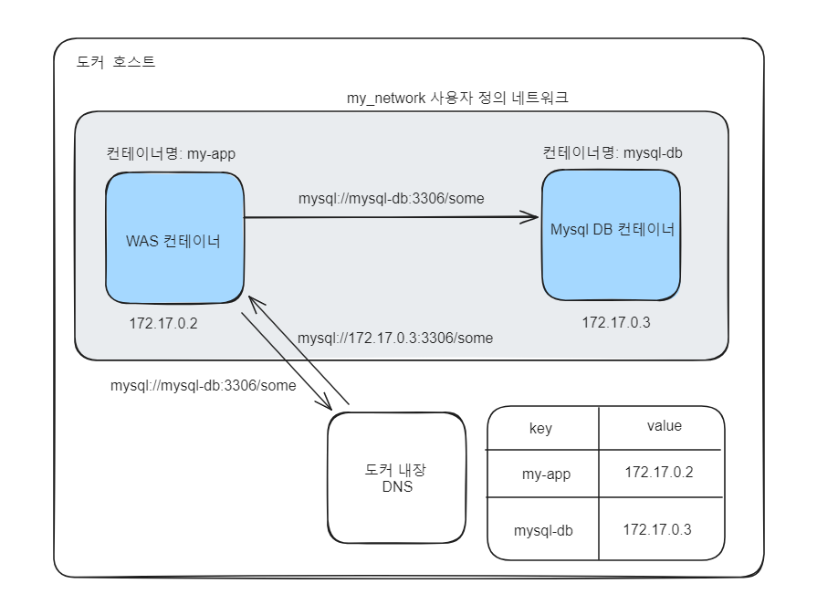

# 도커 가이드 5편: Container networking

```text
도커 컨테이너의 네트워크에 대해서 알아보겠습니다.
```

# 도커 사용시 네트워크를 어떻게 관리할 수 있을까?

- 도커 컨테이너는 호스트와 격리된 자신만의 네트워크 환경을 가지고 있다.
- 도커 컨테이너 내부에서 외부 인터넷으로 요청을 보내는 것은 기본값으로 허용되어있다.
- 도커 컨테이너 내부에서 로컬호스트머신과 통신시 localhost 도메인을 사용할 수 없다.
    - 도커 컨테이너는 외부 네트워크와 격리되어있기 떄문에 localhost는 도커 컨테이너 자체를 가리키기 때문이다.
    - 대신 컨테이너는 도커에서 제공하는 특별한 도메인인 host.docker.internal 을 사용해서 호스트 머신과 통신할 수 있다.
- 컨테이너간 네트워킹은 어떤 방식으로 이루어지는가?
    - 기본적으로 컨테이너간 네트워크 환경은 격리되어있다.
    - 컨테이너마다 부여된 ip 주소로 통신이 가능하다.
    - 그렇지만 컨테이너를 실행할때마다 ip 주소는 바뀔 수도 있고 소스코드에 ip 주소를 하드코딩하면 너무 번거롭고 관리하기 어렵다.
    - 도커 컨테이너의 상세 정보를 조사해보면 현재 컨테이너가 어떤 네트워크에 속한지 알 수 았고 ip 주소를 확인할 수 있다.
    - 컨테이너가 동일한 네트워크에 속하면 컨테이너명을 이용해서도 편리하게 통신할 수 있다.

***해당 컨테이너는 bridge 네트워크에 속한다. ip 주소도 확인할 수 있다.***

```text
# 컨테이너 세부 정보 확인
docker container inspect <container-name>

# 출력 결과
"NetworkSettings": {
            "Networks": {
                "bridge": {
                    "Gateway": "172.17.0.1",
                    "IPAddress": "172.17.0.2",
                    "IPPrefixLen": 16,
                    "IPv6Gateway": "",
                    ...
                }
            }
}
```

# Docker Container Network

- 도커 엔진이 관리하는 네트워크 환경으로 도커 컨테이너 간의 통신 및 호스트 시스템과의 통신을 관리하는 기능을 제공한다.
- 각 컨테이너는 독립적인 네트워크 스택을 가지고 있다.
- 네트워크 드라이버 유형
    - bridge
        - 기본 네트워크 드라이버
        - 일반적으로 애플리케이션이 동일한 호스트의 다른 컨테이너와 통신해야하는 컨테이너에서 실행될때 사용된다.
        - 도커 엔진은 기본적으로 호스트 시스템에 bridge 라는 가상 네트워크를 생성한다.
        - 컨테이너 실행시 컨테이너가 속할 네트워크를 설정하지 않으면 기본적으로 컨테이너는 bridge 네트워크에 속하게 된다.
    - host
        - 컨테이너와 도커 호스트간의 네트워크 격리를 제거하고, 호스트의 네트워크를 공유해서 같이 사용한다.
        - 컨테이너가 호스트 시스템의 네트워크 인터페이스를 직접 사용하므로 가상 네트워크를 이용하지 않는다.
    - none
        - 컨테이너를 호스트 및 다른 컨테이너로부터 완전히 분리한다.
    - 사용자 정의 네트워크
        - 사용자가 직접 정의한 네트워크 환경으로 컨테이너를 그룹화하여 관리할 수 있다.
        - 가상 네트워크 인터페이스를 사용한다.
        - 보통 컨테이너로 서비스를 제공할때는 별도의 네트워크를 정의해서 관련된 컨테이너를 그룹화해서 사용한다.
- 컨테이너간 통신 방법
    - 사용자 정의 컨테이너 네트워크를 생성한 후 컨테이너들을 동일한 네트워크로 연결시킨다.
    - 컨테이너의 ip 주소를 직접 소스코드에 하드 코딩하지 않고, 통신 대상 컨테이너 이름을 호스트 도메인으로 입력한다.
    - 동작 원리
        - 도커 호스트의 내장 DNS 서버에 컨테이너명으로 호스트와 ip 주소를 등록하고 있다.
        - 요청 발생시 내장 DNS 서버를 이용해서 컨테이너 이름으로 ip 주소를 조회하여 통신할 수 있다.

***예: 컨테이너 외부의 또 다른 mysql 컨테이너와 통신시( 컨테이너 이름: mysql-db)***

```text
# 직접 ip 주소를 소스코드에 작성하는 방법. 번거롭고 관리가 어렵다.
mysql://172.17.0.2:3306/some

# 도커 컨테이너 네트워크로 하나의 네트워크에 속한 컨테이너간 통신시 사용할 수 있는 방법
# 컨테이너 이름을 호스트 부분에 직접 작성할 수 있다.
mysql://mysql-db:3306/some
```



### 네트워크 조회

- 기본적으로 도커를 설치하고 처음 네트워크 조회시 3개의 네트워크를 확인할 수 있다.
- bridge, host, none

```text
docker network ls

# 출력 결과
NETWORK ID     NAME            DRIVER    SCOPE
a882455dd111   bridge          bridge    local
8e62bc883bb9   host            host      local
c66db4d2c2d3   none            null      local
```

### 네트워크 생성

```text
docker network create <network-name>

docker network create my_network
```

### 네트워크 정보 확인 검사

- 해당 네트워크에 연결되어있는 컨테이너와 ip 주소를 확인할 수 있다.

```text
docker network inspect <network-name>

docker network inspect my_network
```

### 네트워크 삭제

```text
docker network rm <network-name>

docker network rm my_network

# 사용하지 않는 네트워크 모두 삭제
docker network prune
```

### 생성한 네트워크에 컨테이너 연결

- 네트워크는 항상 먼저 만들어야한다. 
- 컨테이너를 실행시키면서 생성한 네트워크에 연결할 수 있다.
- 다수의 컨테이너를 하나의 네트워크로 묶을 수 있다.
- 네트워크 내부에서는 모든 컨테이너간 자유롭게 통신할 수 있으므로 '-p' 플래그를 사용할 필요없다.
- '-p' 플래그는 로컬 호스트 머신이나 컨테이너 네트워크 외부에 통신할때만 필요하다.

```text
docker run --network <network-name> <container-image>

docker run -d --name mysql-db --network my_network mysql
```

### 도커 컨테이너를 네트워크에서 분리

```text
docker network disconnect <network-name> <container name/id>
```

### 참고

- [docker network](https://docs.docker.com/network/)
- [docker network cli reference](https://docs.docker.com/reference/cli/docker/network/)
- [Udemy: Docker & Kubernetes: The Practical Guide](https://www.udemy.com/course/docker-kubernetes-the-practical-guide/)
